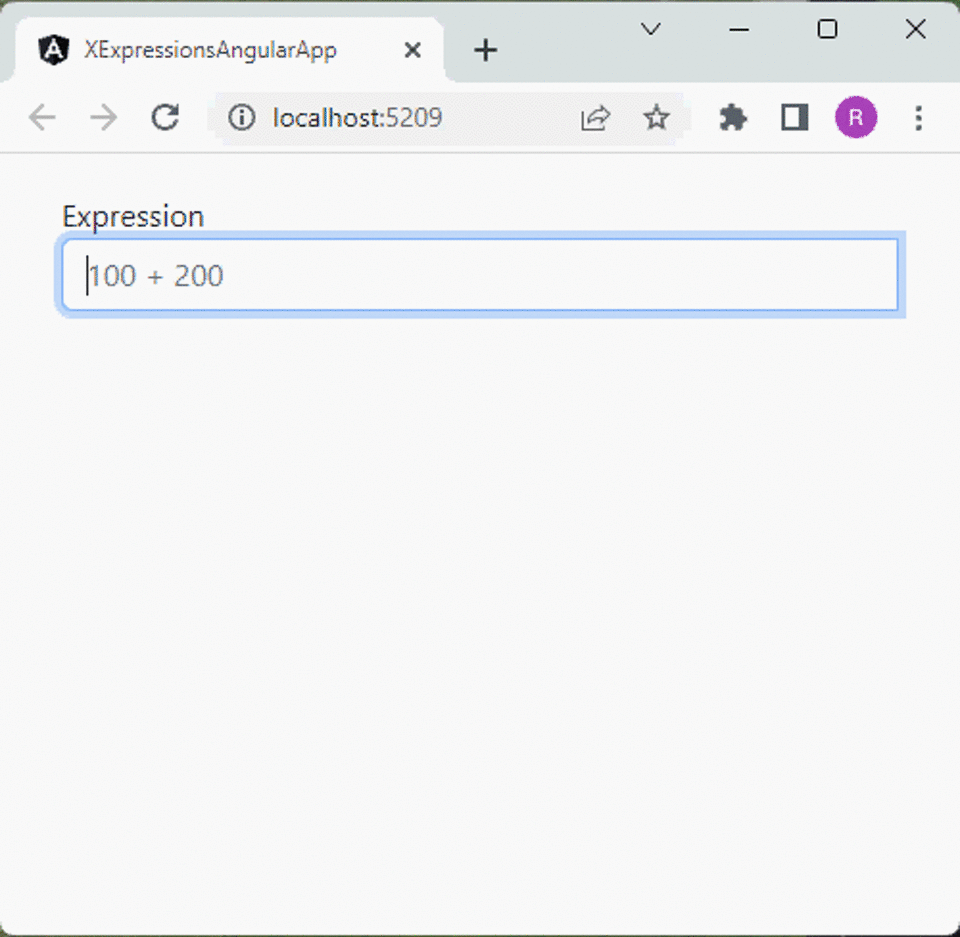

# XExpressions

A library for evaluating arbitrary expressions. For example:
```csharp
Evaluator eval = new Evaluator("1 + 2");
Variant result = eval.Evaluate();
```

## Features

| Feature | Description |
|---|---|
| Standard Functions | A set of standard functions can be made available such as min, max etc...|
| Custom Functions | Add your own functions to the expression language.<br /><br />You provide the name of the function and a delegate to invoke when it used.<br /><br />For example,  you can create a function called `myfunc` and use it in an expression such as `myfunc(10, 20, 30) * 40` |
| Custom Variables/Constants | Add your own variables or constants to the expression language.<br /><br />You provide the name of the variable/constant and a delegate to retrieve the value when its used.<br /><br />For example, you create a variable called `amount` and use it in an expression such as `amount * 0.175` |
| Expression Tree | The expression text is broken down into a tree that can be examined or converted to an [SVG](https://en.wikipedia.org/wiki/SVG) to view an image of how the expression is evaluated. |
| NuGet package | Available as a nuget package https://www.nuget.org/packages/XExpressions |

---

## Basic Usage
The `Evaluator` class is used to evaluate the expression. For example:
```csharp
Evaluator eval = new Evaluator("1 + 2");
Variant result = eval.Evaluate();
```

### Variant Data Type
The result of an expression is a `Variant`.  The variant can represent a decimal, string or boolean. For example:
```csharp
Evaluator eval = new Evaluator("1 + 2 * 3 / 4");
Variant result = eval.Evaluate();

if (result.Kind == VariantKind.Decimal)
	Console.WriteLine($"Result is: {(decimal)result}");
else if (result.Kind == VariantKind.String)
	Console.WriteLine($"Result is: {(string)result}");
else if (result.Kind == VariantKind.Boolean)
	Console.WriteLine($"Result is: {(bool)result}");
```

## Custom Functions
To add your own functions use `XExpressionsSettings` to specify the name of the function and a delegate to invoke when it is used. For example:
```csharp
XExpressionsSettings settings = new XExpressionsSettings();

// Add a function called MyFunc that takes two parameters and adds them
settings.AddFunction(Name: "MyFunc", ParameterCount: 2, 
	(name, args) => args[0] + args[1]);

// Evaluate an expression using the function
Evaluator eval = new Evaluator("myfunc(100, 200)", settings);
Variant result = eval.Evaluate();

// result is 300
```

## Custom Constants or Variables

To add your own constants or variables use `XExpressionsSettings` to specify the name and a delegate to invoke when it is used.  For example:
```csharp
XExpressionsSettings settings = new XExpressionsSettings();

// Add a constant call pi
settings.AddIdentifier(Name: "pi", (name) => 3.14);

// Add a variable called radius
settings.AddIdentifier(Name: "radius", (name) => 5);

// Evaluate an expression using the constant/variable
Evaluator eval = new Evaluator("2 * pi * radius", settings);
Variant result = eval.Evaluate();
```

## Expression Tree
The expression text is broken down into an expression tree which is then evaluated.  The tree is available using the `Evaluator.RootNode` property.  For example:
```csharp
Evaluator eval = new Evaluator("1 + 2 * 3 / 4");

// Get the tree
ExpressionNode node = eval.RootNode;

// Convert the tree into an SVG
string svg = node.CreateSvg();
```

The `CreateSvg` method requires adding the [XExpressions.SVG](https://www.nuget.org/packages/XExpressions.SVG) package.

**NOTE:** The SVG functionality was an after thought, is not beautiful and has its issues but is sufficient to get an understanding of what the tree looks like.

For the expression `1 + 2 * pi / 4 + min(10, 20)` the tree looks like:


## Example Application

The repo contains an example application that allows you to enter an expression and get a result.  It also displays
an image of the tree that was generated to evaluate the expression:



The example application consists of a REST API to evaluate an expression and an angular app for the user to enter the expression.

To build the application, clone the repository and run the following:

1. `cd ExampleApp\\ClientApp`
2. `npm install`
3. `cd ..\\..`
4. `dotnet run --project ExampleApp --framework net7.0`

Then navigate to [http://localhost:5209](http://localhost:5209) in your browser.